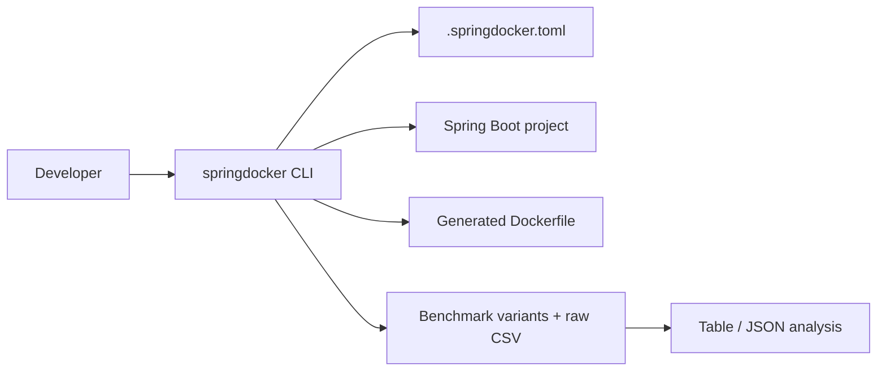

# springdocker

Developer toolkit for Spring Boot containerization and benchmark-driven JVM tuning.

`springdocker` is a Python CLI that helps you inspect a Spring Boot project, generate a Dockerfile, create benchmark assets, run benchmark suites, and summarize benchmark results.

## Architecture



See `docs/architecture.md` for the detailed module map and command lifecycle.

The repo is split into three main surfaces:

- `src/springdocker/` - installable CLI package and core implementation.
- `samples/java-spring-docker/` - sample Spring Boot project used by the CLI and benchmark assets.
- `cli/README.md` - command reference and configuration details.

## What it does

- Detects Maven or Gradle projects.
- Writes a starter `.springdocker.toml` config.
- Generates optimized Dockerfiles for the sample workflow.
- Creates benchmark variants and runs benchmark suites.
- Summarizes benchmark CSV output as a table or JSON.

## Quick start

```bash
cd /path/to/your-repo
python3 -m venv .venv
. .venv/bin/activate
python3 -m pip install -e .

springdocker doctor --project-root samples/java-spring-docker
springdocker init --project-root samples/java-spring-docker --build-tool maven
springdocker dockerfile generate --project-root samples/java-spring-docker --output Dockerfile.generated
springdocker benchmark generate --project-root samples/java-spring-docker --java-version 25
springdocker benchmark run --project-root samples/java-spring-docker --profile quick
springdocker benchmark analyze --project-root samples/java-spring-docker samples/java-spring-docker/benchmarks/04-custom-jre-jlink/results/raw.csv
```

## CLI workflow

1. `doctor` checks the project root and build tool.
2. `init` writes a starter config file.
3. `dockerfile generate` writes a Dockerfile to the requested path.
4. `benchmark generate` creates benchmark scenarios.
5. `benchmark run` executes the benchmark runner.
6. `benchmark analyze` turns `raw.csv` into a table or JSON summary.

See `cli/README.md` for the command reference and config precedence rules.

## Benchmark methodology

See `docs/benchmark-methodology.md` for the benchmark model, run profiles, and summary calculations.

The sample project keeps benchmark scenarios under `samples/java-spring-docker/benchmarks/`.
Each scenario stores generated Dockerfiles and a `results/raw.csv` file so the output stays reproducible and easy to compare.

Current reports focus on:

- image size
- build duration
- startup latency
- success rate

Benchmark summaries can be rendered as:

- terminal tables
- JSON

## Supported stack

This repository currently targets:

- Python 3.10+ for the CLI
- Maven or Gradle Spring Boot projects
- Spring Boot 4.0.1 sample project
- Java 25 sample configuration

## Project docs

- `docs/architecture.md`
- `docs/benchmark-methodology.md`
- `docs/onboarding.md`
- `docs/jvm-optimization.md`
- `ROADMAP.md`
- `SECURITY.md`
- `CONTRIBUTING.md`

## Comparison with adjacent tools

| Tool | Focus | What springdocker adds |
|---|---|---|
| Jib | Dockerless image build | benchmark-aware Dockerfile and runtime tuning workflows |
| Buildpacks | Opinionated platform build | explicit Dockerfile generation and benchmark artifacts |
| Manual Dockerfiles | Full control | project detection, config, and repeatable benchmark analysis |

## Sample project docs

- `samples/java-spring-docker/README.md`
- `samples/java-spring-docker/HELP.md`
- `samples/java-spring-docker/tools/README.md`

## Contributing

The main package is under `src/springdocker/`. Run `pytest`, `ruff check src tests`, and `mypy src` before pushing changes.
