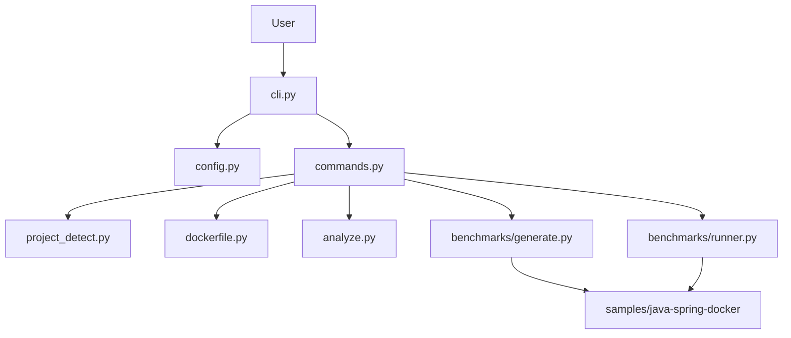

# Architecture

`springdocker` is organized around a small CLI core and a sample Spring Boot project that acts as the target for generation and benchmark workflows.

## High-level flow

## Module responsibilities

| Module | Responsibility |
|---|---|
| `src/springdocker/cli.py` | Parse CLI arguments and dispatch commands. |
| `src/springdocker/commands.py` | Orchestrate command execution and I/O. |
| `src/springdocker/config.py` | Load `.springdocker.toml` and resolve command settings. |
| `src/springdocker/project_detect.py` | Detect Maven/Gradle markers and Spring Boot hints. |
| `src/springdocker/dockerfile.py` | Render Dockerfiles from structured options. |
| `src/springdocker/analyze.py` | Summarize benchmark CSV data and format reports. |
| `src/springdocker/benchmarks/` | Generate and run benchmark scenario assets. |

## CLI execution lifecycle

1. `cli.py` builds the parser.
2. `main()` resolves the project root and loads config when needed.
3. A resolver in `config.py` merges CLI flags, config files, and defaults.
4. `commands.py` validates the project and performs the work.
5. Supporting modules write files, render Dockerfiles, or analyze CSV output.

## Configuration resolution

The precedence used across the CLI is:

1. CLI flags
2. `.springdocker.toml`
3. built-in defaults

The configuration loader validates the schema early so invalid keys fail fast instead of being silently ignored.

## Dockerfile generation pipeline

`cmd_dockerfile_generate()`:

1. Inspects the project root and build tool.
2. Optionally falls back to the legacy sample script path.
3. Parses `must_have_modules_file` when provided.
4. Calls `build_dockerfile()` with structured options.
5. Writes the generated file to the target path.

`dockerfile.py` currently produces:

- multi-stage build stages
- optional jlink runtime stage
- non-root runtime defaults
- tuned JVM flags

## Benchmark pipeline

`cmd_benchmark_generate()` creates benchmark assets under the sample project.
`cmd_benchmark_run()` executes the benchmark runner and writes raw CSV output.
`cmd_benchmark_analyze()` reads CSV output and renders a summary table or JSON document.

This split keeps generation, execution, and reporting independent so each step can be validated on its own.

## Extension points

New features should usually be added in one of these places:

- CLI argument parsing: `cli.py`
- orchestration and validation: `commands.py`
- config schema and resolution: `config.py`
- Dockerfile output changes: `dockerfile.py`
- benchmark reporting: `analyze.py`
- extension examples and wrapper patterns: `docs/extensions.md`

If a change affects generated output, add tests for both the direct helper and the CLI flow that exercises it.
